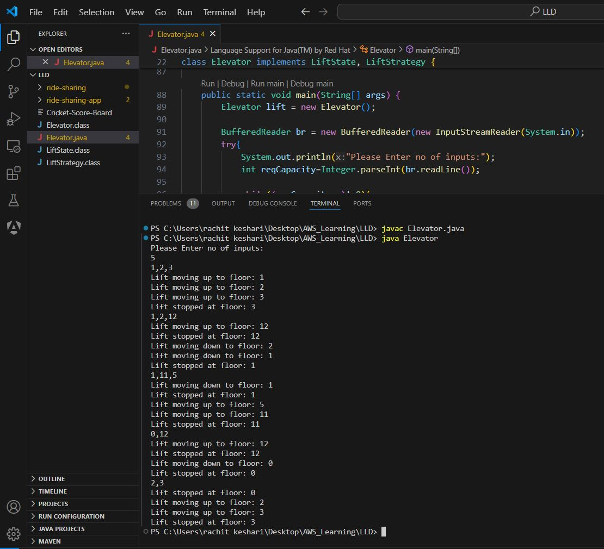
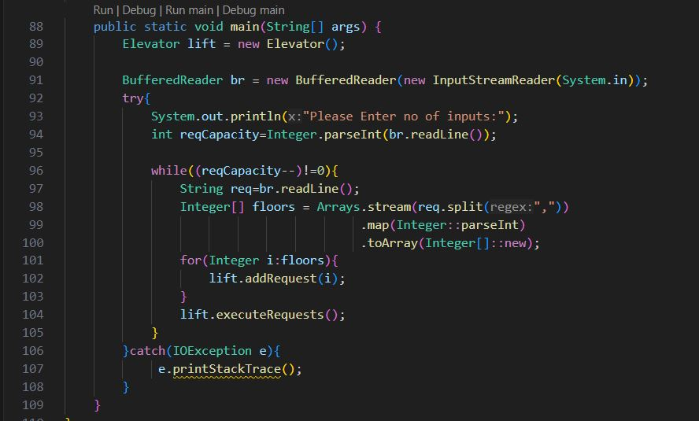

# LLD-lift-elevator

## Lift Elevator System
This repository contains a simple implementation of a lift (elevator) system in Java. The code simulates an elevator that processes floor requests and moves between floors based on the requests.

## Design Overview
The lift system is designed using the following interfaces and classes:

### Interfaces

#### `LiftState`
- Represents the state of the lift.
- Methods:
  - `void moveUp()`: Moves the lift up to the next floor in the queue.
  - `void moveDown()`: Moves the lift down to the next floor in the queue.
  - `void stop()`: Stops the lift at the current floor.

#### `LiftStrategy`
- Represents the strategy for handling lift requests.
- Methods:
  - `void addRequest(int floor)`: Adds a floor request to the appropriate queue.
  - `int nextFloor()`: Returns the next floor to which the lift should move.

### Classes

#### `Elevator`
- Implements both `LiftState` and `LiftStrategy`.
- Manages the current floor, direction of movement, and floor requests.
- Fields:
  - `int currentFloor`: The current floor of the lift.
  - `boolean movingUp`: Indicates whether the lift is moving up.
  - `TreeSet<Integer> upRequests`: Queue for floor requests in ascending order.
  - `PriorityQueue<Integer> downRequests`: Queue for floor requests in descending order.
- Methods:
  - `void moveUp()`: Moves the lift up to the next floor in the `upRequests` queue.
  - `void moveDown()`: Moves the lift down to the next floor in the `downRequests` queue.
  - `void stop()`: Stops the lift and determines the next direction based on pending requests.
  - `void addRequest(int floor)`: Adds a floor request to the appropriate queue based on the current floor.
  - `int nextFloor()`: Returns the next floor to move to based on the current direction and pending requests.
  - `void executeRequests()`: Processes and executes all pending floor requests.

## Usage

### Running the Elevator System

To run the elevator system, compile and execute the `Elevator` class. The program will prompt you to enter the number of inputs (floor requests). Each input should be a comma-separated list of floor numbers.

sample output & code screen-shot:
 

